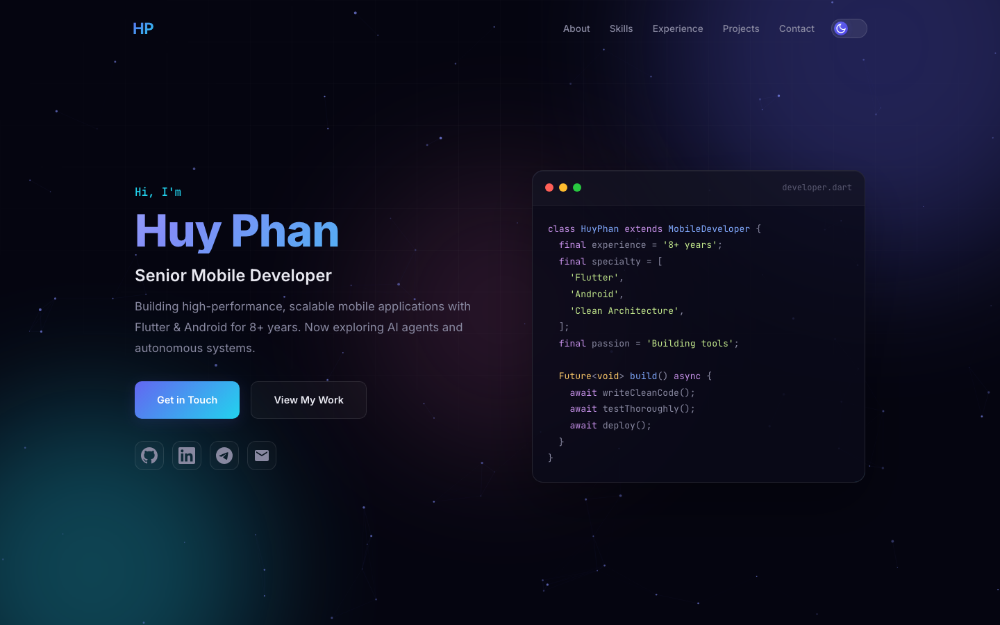
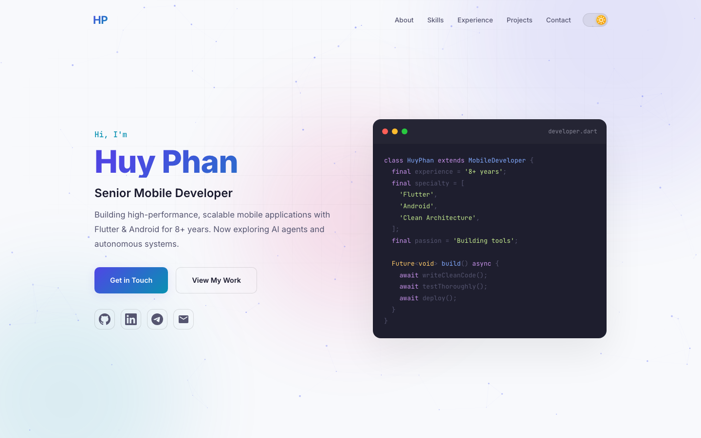

# Huy Phan — Portfolio

Personal portfolio site built with vanilla HTML, CSS, and JavaScript. Deployable to GitHub Pages with zero build step.

## Preview

| Dark Mode | Light Mode |
|-----------|------------|
|  |  |

## Features

- **Liquid glass navigation** — floating frosted-glass header with shimmer border, transparent at top, glass on scroll
- **Dark / Light theme** — pill toggle with animated icons, persisted in localStorage, respects OS preference
- **Particle constellation** — interactive canvas background with mouse-reactive connections
- **Typing effect** — cycles through roles: Flutter Specialist, AI Agent Explorer, Clean Architecture Advocate, etc.
- **3D tilt cards** — perspective mouse-follow effect on skill and project cards
- **Scroll animations** — staggered fade-in with IntersectionObserver
- **Fully responsive** — optimized for desktop, tablet, and mobile (down to 375px)

## Sections

- **Hero** — intro with Dart code block and social links
- **About** — summary with animated stat counters (8+ years, 15+ projects, 7+ years Flutter)
- **Skills** — 8 cards including AI & Intelligent Agents (trending), Cross-Platform Mobile, Native Android, Architecture, Testing, APIs, Developer Tooling, DevOps
- **Experience** — timeline from Gameloft (2017) to present roles
- **Projects** — key projects with GitHub links for open-source repos
- **Contact** — Email, GitHub, LinkedIn, Telegram, Phone

## Tech Stack

HTML + CSS + vanilla JS. No frameworks, no build tools.

- Google Fonts (Inter, JetBrains Mono)
- CSS custom properties for theming
- Canvas API for particles
- IntersectionObserver for scroll animations

## Deploy to GitHub Pages

```bash
git init
git add .
git commit -m "Initial portfolio"
git remote add origin git@github.com:<username>/<username>.github.io.git
git push -u origin main
```

Site will be live at `https://<username>.github.io`

## Author

**Phan Bao Huy** — Senior Mobile Developer

- GitHub: [phanbaohuy96](https://github.com/phanbaohuy96)
- Email: baohuy.phan1996@gmail.com
- Telegram: [@pbh96](https://t.me/pbh96)
